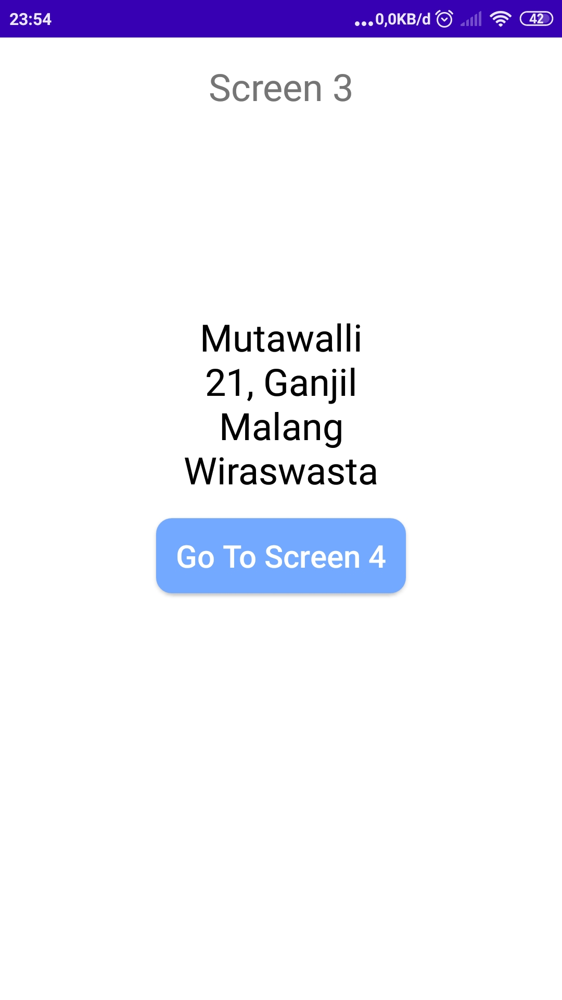

# Challenge-Chapter-3

## About
An Android Developer is a Software Developer who specializes in designing applications for the Android marketplace. 
This means most of an Android Developer’s job revolves around creating the apps we use on our smartphones and tablets. 
Android Developers can either work in-house for a large organization, or they can be employed by an App Development agency.

This application was originally created by Muhammad Mutawalli Sya'rawi For Complete Challenge Chapter 3 about Fragment, Intent, Bundle, and Navigation Component.

Keep Breathing and Stay Awesome, Peace :v:

# Screenshot
## Here some screenshot of the program.

Screen 1                   |  Screen 2 Input Nama      |  Screen 3 Hasil Nama 
:-------------------------:|:-------------------------:|:-------------------------:
     |     |  

Screen 4 Input Biodata     |  Screen 3 Hasil Biodata (Genap)|  Screen 4 Input Biodata
:-------------------------:|:-------------------------:|:-------------------------:
     |     |  

Screen 3 Hasil Biodata (Ganjil) |
:-------------------------:     |
          | 

